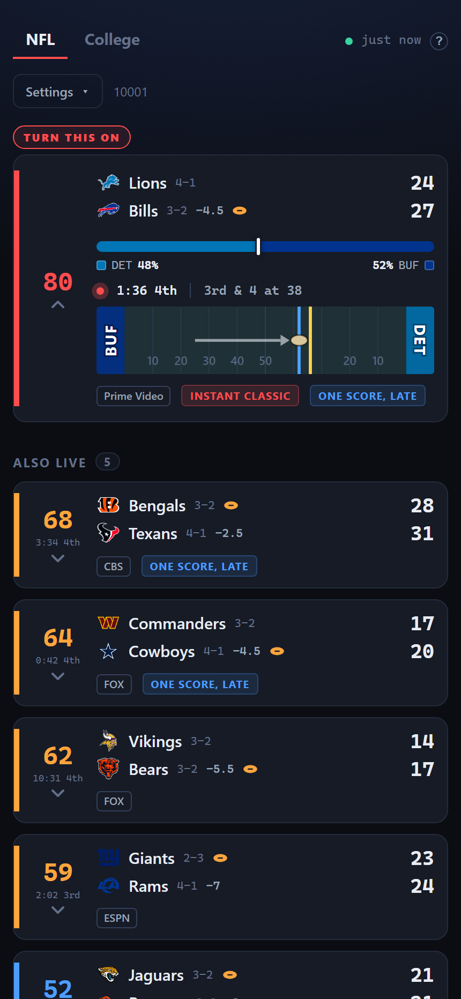
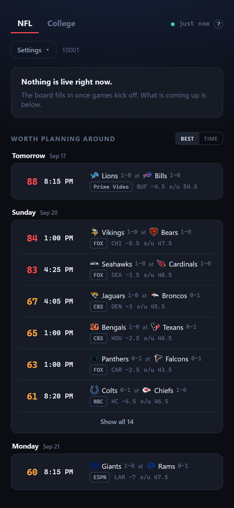
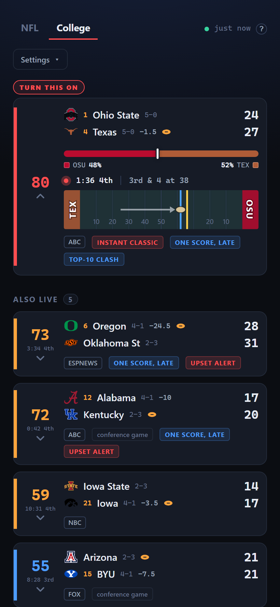
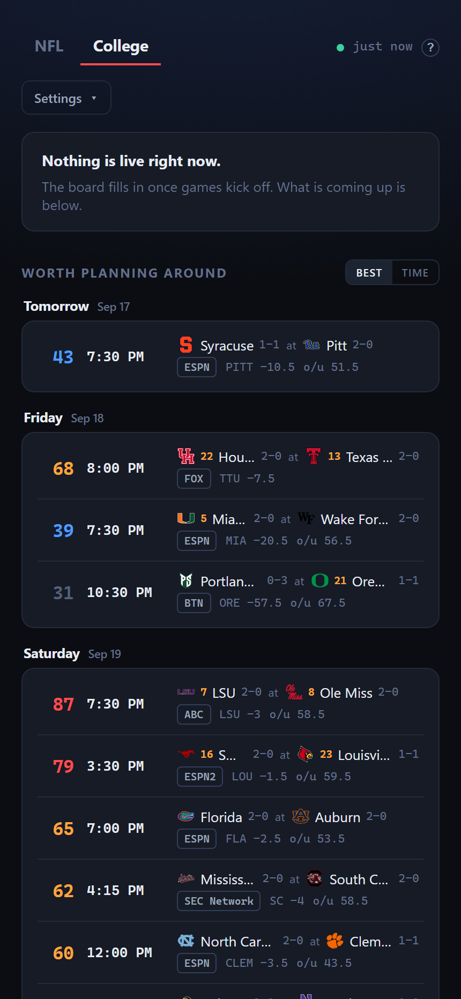

#  Football: What Should I Be Watching

A live board that answers one question: **which football game should I have on right now?**

Rankings and records tell you which games *matter*. They do not tell you which game is
currently a one-score fight with four minutes left. This polls the public ESPN scoreboard and
ranks every in-progress game by how good it is at this moment, then ranks the week ahead by how
much each matchup is worth planning around.

Covers the **NFL** and **college football** on separate tabs, each with its own calibration.

No API key, no account, no database.

> **The screenshots below use test data.** Scores, clocks and records are fabricated, and the
> slate is whichever week they happened to be captured in, so nothing shown is a real assessment
> of any game.

| | What is on right now | What to plan around |
| --- | --- | --- |
| **NFL** |  |  |
| **College** |  |  |

<sub><a href="docs/design-notes.md">Design notes</a> cover how these are regenerated.</sub>

## What the board shows

**Live games**, best first. Each card carries the score, live win probability, the clock and
situation, who has the ball, the network, the pregame line, and any tags that apply:
`GAME ON THE LINE`, `UPSET ALERT`, `RECENT SWINGS`, `INSTANT CLASSIC`, `OVERTIME`.

**Worth planning around**, the next few days grouped by day, days in order, so an earlier day's
games are never buried under a better game later in the week. Every game on a day is listed. Within a day, **Best** ranks by rating and **Time**
runs chronologically, for reading the day in order and seeing which slots are worth it. **Window**
splits the day into its kickoff windows and ranks within each, so an NFL Sunday reads as **Early**,
**Late** and **Primetime**, with a **Morning** window on the weeks there is a game from London. Any
window the naming does not fit keeps its kickoff time. It appears only on days whose kickoffs
actually form windows, which in practice means the NFL: a Saturday in college spans eleven distinct
kickoff hours and has none.
Each row shows kickoff time, the line, the over/under and the network.

**Recently finished**, the recap, best first. Games stay on the board for eighteen hours after
kickoff.

An open live card draws the field: where the ball is, the line of scrimmage, the line to gain, how
far the drive has come and which way the offense is going. The field is always drawn. Each marker
appears only while the data behind it is current, so between drives and on kickoffs the field is
there and empty.

Live cards fold by default and open when tapped, six at a time with an expander for the rest. The
best game on starts open. A folded card keeps the teams, records, line, possession, score, clock,
network and tags; opening one adds the win probability, down and distance, and the last play.
Finished games do not fold, but the same six-at-a-time expander applies.

**Alerts**, optional, off by default. Five kinds, chosen per league: a game becoming worth
switching to, one turning into something memorable, an upset in progress, the pick of a busy
kickoff window, and NFL primetime, where the only game in its slot is starting and the alert says
plainly how good it is expected to be. At most three a day per league. Each one names the channel
and says when a game is out of market; **My channels first** stops those arriving at all. The
screen stays awake while the board is open.

**No spoilers**, NFL only. Name the teams whose games you watch in full and late, and while one is
on the board hides its score, clock, rating, win probability, drive, last play, records and labels,
sorts it to the bottom and sends no notifications about it. A tap asks before it shows you, and
reloading forgets that you asked. Games that have not kicked off are untouched.

**League tabs** switch between NFL and college; the NFL opens by default. **Favorite
conferences** push the games you care about up the board, weighted higher when both teams
qualify than one. Tab, favorites and market all persist in the browser.

## Explaining itself

The `?` in the header opens a plain-language account of what the rating means and what each setting
does.

## How the score works

Every live game gets a 0-100 score and the board sorts on it.

**The main term is how close the game is, weighted by how late it is.** Closeness comes from
ESPN's live win probability, falling back to a margin curve when ESPN stops publishing one.

**Four other terms can take over when closeness misses the point.** A one-score game inside the final
five minutes, with the trailing team holding the ball, gets a `clutch` score. An underdog running
away from where the closing line put it gets an `upsetTension` score. A finished game that a real
underdog won gets a `decisiveness` score. And a game that has only just kicked off keeps a fading
share of what it was billed as, gone by halftime and sooner if it turns into a blowout. The dominant
term is whichever of the five is highest.

Five smaller components adjust it, with fixed weights:

| Component | What it measures | Weight |
| --- | --- | --- |
| `primary` | Closeness weighted by how late, or whichever of the three escape hatches beats it | 0.58 |
| `prominence` | How much of the country cares | 0.18 |
| `swing` | Win-probability movement over the last fifteen minutes | 0.08 |
| `upset` | How far the underdog is running ahead of the closing line | 0.07 |
| `stakes` | What the game decides | 0.05 |
| `pace` | Projected total points, so a 45-38 beats a 10-7 | 0.04 |

The components are the same for both leagues; what feeds them is not.

| Component | College | NFL |
| --- | --- | --- |
| `prominence` | Conference tier, best AP rank, broadcast slot | Best record, best playoff seed, kickoff slot |
| `upset` | Closing line, rank gap as fallback | Closing line, record gap as fallback |
| `stakes` | Both ranked, both top-10, conference game | Division game, both contenders, both winning |
| `pace` | Scaled around a 55-point total | Scaled around a 45-point total |

Upcoming games get a separate `anticipation` rating, driven mostly by the spread.

Why each term is shaped the way it is, and the games that forced those decisions, are in
[docs/design-notes.md](docs/design-notes.md).

### What a number means

| Pregame | Reads as |
| --- | --- |
| 80+ | Rare. Two good teams, tight line, big slot |
| 70-79 | Should be a good one |
| 55-69 | Worth having on |
| under 55 | Background noise |

Read each tab against itself; the two leagues produce different distributions. Pregame
`anticipation` and the live score are different scales too. On the live board, `TURN THIS ON`
fires at 75.

## Which tab you land on

When one league has football on and the other does not, the board opens on the one with the games,
whichever tab you left it on. That choice is kept, so it is the tab you come back to.

Tapping a tab always wins, and holds until the other league becomes the one with the games on.

## Keeping up with your television

The push feed puts a play on the board about two seconds after it happens, and a broadcast runs
anywhere from ten seconds to a minute behind that, so by default the board spoils the game it is
meant to help you watch.

The delay control in the header holds the board behind live by a number of seconds you choose. Set
it by nudging rather than by guessing your feed's latency: adjust it while watching until the score
changes on screen at the same moment you see it change. Presets are rough starting points, cable
near fifteen seconds and a streaming app near thirty-five.

The setting is per browser, so two people watching different feeds each get their own. Notifications
are held by the same amount.

## Can I actually watch it

On Sunday afternoons the networks split the slate by market: eight games kick at 1:00, but only
one CBS and one FOX game reaches any city.

The board reads the Gracenote listings grid for your postal code and reports which of them your
own affiliates are carrying. The channel chip names the station showing a game, or says the game
is out of market.

College is covered too. Those games are never split by market, so none of them is ever out of
market, but a college game on ABC, CBS, FOX or the CW is on your local affiliate and the chip
names it.

**My channels first**, off by default, sorts games your market is not showing to the bottom, fades
them and leaves them out of notifications. It appears once a market is set.

Behind Cloudflare you do not have to type a postal code: switch on the managed transform *Add
visitor location headers* and the board uses `CF-Postal-Code` as the default market. The control
has three states: a postal code you typed, the detected one, and explicitly off. **Clear** turns it
off entirely and **Redetect** goes back to the network's answer.

With no postal code from any source, nothing is flagged and the board behaves as though the
feature were not there.

## Running it

```bash
npm install
npm run dev
```

The Vite dev server comes up on <http://localhost:5180> and proxies `/api` to the poller on port
8787. `npm run dev:server` and `npm run dev:web` run the two halves separately.

Both halves bind all interfaces, so other devices on the LAN can load the board at
`http://<your-lan-ip>:5180`. Vite prints the reachable addresses on startup. To reach it by
hostname instead, set `ALLOWED_HOSTS=name1,name2`.

## Deploying

CI publishes an image to GHCR on every push to `main`. The compiled server has no runtime
dependencies beyond Node itself.

```bash
docker run -d --name football-watchability \
  -p 8787:8787 \
  -e TZ=America/New_York \
  --restart unless-stopped \
  ghcr.io/micahmo/football-watchability:latest
```

The board needs no database. All of it is in memory and rebuilds from ESPN within a poll or two, so
the container can be replaced. A restart is not free during a slate, though:

- Closing lines are refetched one game at a time, so upset ratings read low until they are back.
- The TV listings cache empties, so the market reads as unset for a few seconds until it refetches.
- Win-probability swing history resets, which suppresses `RECENT SWINGS` for about fifteen minutes.
- Games already in progress are treated as old news, so their kickoff notification never arrives.

None of it lasts more than a few minutes, but a quiet window is a better time to update than the
middle of a Saturday.

**Notifications need a volume.** A push keypair and its subscriptions cannot be rebuilt from
anywhere, and the same directory holds the history log. Mount one at `/config`:

```bash
docker run -d --name football-watchability \
  -p 8787:8787 \
  -e TZ=America/New_York \
  -v /path/on/host:/config \
  --user 99:100 \
  --restart unless-stopped \
  ghcr.io/micahmo/football-watchability:latest
```

The image runs as a non-root user and never chowns anything, so the uid has to match whoever owns
the volume. `99:100` is Unraid's appdata owner; elsewhere, use your own.

`/config` is the default inside a container; set `NOTIFY_DIR` only to use a different path.

Without a volume, notifications are unavailable and everything else is unchanged. The server reads
the mount table rather than trusting the path, so a forgotten `-v` hides the toggle and says why,
instead of collecting subscriptions that vanish on the next update.

**Set `TZ` to US Eastern or near it.** The poller asks ESPN for "yesterday through today", and
those day boundaries are what keep a game running past midnight visible.

An Unraid template is included at [unraid/football-watchability.xml](unraid/football-watchability.xml).

### Behind a reverse proxy

Point the proxy at port `8787`. The app is a single origin serving both the page and its API, so
there is no path splitting and no CORS configuration. It sets no cookies and requires no auth
headers, so a plain `proxy_pass` is enough.

Serving it over HTTPS on a real hostname is also what makes it installable as a PWA. A browser
only offers to install from a secure context, which rules out plain-http LAN addresses.

## Configuration

| Variable | Default | Purpose |
| --- | --- | --- |
| `PORT` | `8787` | API and static server port |
| `HOST` | `0.0.0.0` | Bind address |
| `TZ` | container default | Day boundaries for the scoreboard query. Use US Eastern |
| `DIST_DIR` | `../dist` | Built frontend location. Set in the container |
| `POLL_MS` | `30000` | Poll interval while games are live |
| `IDLE_POLL_MS` | `300000` | Poll interval when nothing is live |
| `ESPN_GROUPS` | `80` | ESPN group id, college only. `80` is FBS, `81` is FCS |
| `ESPN_DATES` | current range | `YYYYMMDD` or a range. Pins the board to a past slate |
| `SCHEDULE_DAYS` | `8` | How far ahead the schedule is fetched |
| `SCHEDULE_POLL_MS` | `600000` | Schedule refresh interval |
| `RECENT_WINDOW_HOURS` | `18` | How far back the recap reaches |
| `ALLOWED_HOSTS` | - | Extra hostnames the dev server answers to, comma separated |
| `NOTIFY_DIR` | `/config` in a container | Where push keys, subscriptions and the history log live. Must be a mounted volume; the server checks |
| `NOTIFY_CONTACT` | `mailto:nobody@example.com` | Who runs this server, as `mailto:` or `https:`. Web Push signs it into every request so a push service can contact you about a misbehaving server. A private board never needs it |

Replaying a past slate is the easiest way to see a full board on a quiet weeknight:

```bash
ESPN_DATES=20260905 RECENT_WINDOW_HOURS=120 npm run dev:server
```

## API

- `GET /api/snapshot?league=nfl|cfb` - the full ranked board (`live`, `upcoming`, `recent`)
- `GET /api/snapshot?league=nfl&zip=02134` - the same board, annotated with what that market is
  carrying. Both leagues
- `GET /api/stream` - the same board as a live event stream, same query parameters
- `GET /api/teams` - every NFL team with division and conference, for the no-spoiler control
- `GET /api/health` - per-league poller status, last update, failure count, next poll
- `GET /api/notifications/config` - whether alerts are available, and the public push key
- `POST /api/notifications/subscribe` - register a push subscription and its preferences
- `POST /api/notifications/unsubscribe` - drop one
- `POST /api/notifications/ack` - the service worker reporting that a push arrived

Those three POSTs are the only writes the server accepts; bodies are capped at 8 KB and every
field is validated. Every other method and path returns 405.

## Layout

```
server/     per-league pollers, ESPN client, scoring model, prominence table,
            NFL standings, market listings, line and swing caches
shared/     types and scoring weights used by both halves
scripts/    replay tool for checking the model against finished games
src/        Svelte 5 dashboard
docs/       design notes
unraid/     container template
```

`npm run check` typechecks all three projects (Svelte app, Vite config, server).

## Known limitations

- **Rivalry and playoff-elimination stakes are not modeled.** Those are the two things the
  numbers genuinely cannot see, and both would need a hand-maintained list.
- Conference tiers are a static table in `server/prominence.ts` and need editing when
  realignment moves teams around.
- Where no closing line exists, mostly FCS matchups, upset detection falls back to the rank gap,
  which cannot tell a mismatch from a coin flip.
- Swing history is in memory only, so a restart suppresses `RECENT SWINGS` until it refills.
- Market listings are cached for six hours, so a lineup change can take that long to show.
- NFL prominence leans on records and seeding, so it is near-flat in week one when everyone is
  0-0 and sharpens as the season goes.
